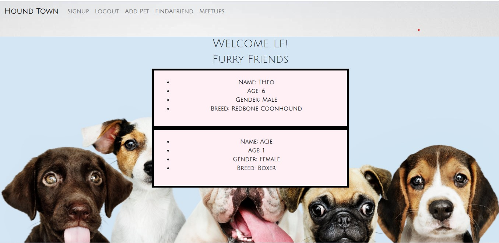

# Project-3-Unit-23

Welcome to Hound Town! A safe space to meet other pet owners and to find + create pet events in your area. 

This MERNG (MongoDB, Express.js, React.js, Nodejs, Graphql) stack single-page application concept was designed to be a doggie play date application. Hound Town displays the users pet information, allows the user to submit and post events, is also a place for the user to find pet events in a their desired area and allows them to be able to contact and arrange playdates.

# Table of Contents
1. [Title](Title)
2. [Description](#description)
3. [Installation](#installation)
4. [Contributing](#contribution)
5. [Questions](#questions)
6. [License](#license)
7. [Heroku](#Heroku)
8. [Screenshot](#screenshot)
# Installation 
npm install
# Contribution
<a href="https://github.com/Lyndseyfin">Lyndsey Finamore</a>
 
<a href="https://github.com/RLacer">Rebecca Lacer</a>
 
<a href="https://github.com/killjoyangel">Ariel Marchand</a>
 
<a href="https://github.com/CobaltFrostfish">Chris Whalen</a>
 
<a href="https://github.com/CoderLeE920">Thai Lee</a>
# Questions

## GitHub Application Repo
<a href="https://github.com/killjoyangel/Hound-Town">Hound Town</a>

## Team Emails
 lyndseyfinamore@gmail.com -Lyndsey
  
 r.a.lacer@hotmail.com -Rebecca
  
 Killjoydesigner@gmail.com -Ariel
  
 Chris.Whalen37@gmail.com -Chris
  
 leethai52@outlook.com -Thai

## License

## Heroku
<a href="https://guarded-earth-72226.herokuapp.com/">Hound Town</a>

## Screenshot

